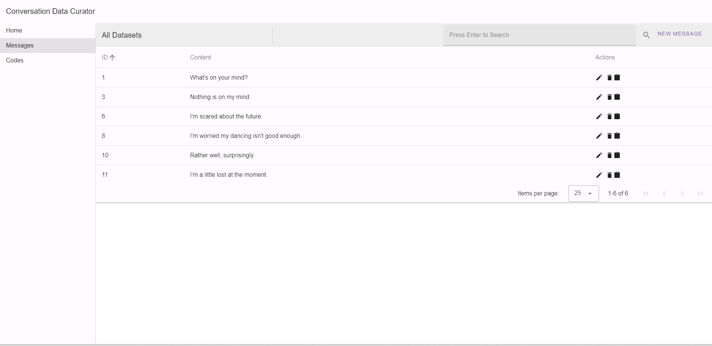
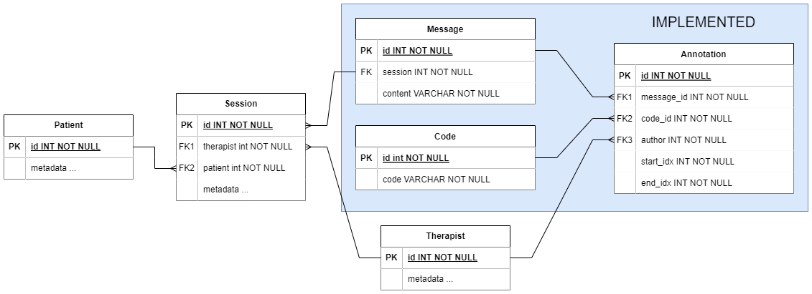

# Conversation Data Curator

This web app allows users to curate datasets of conversation snippets and annotate them with codes signalling the significance of certain words or phrases in the snippets.
This project originated as a take-home assignment for a job application with Cam AI.


## Set up and Usage
### API
For the backend, we use the [pdm](https://github.com/pdm-project/pdm) Python package manager.

To set up the environment given in pyproject.toml, run
```pdm install```.

Then, FastAPI API can then be launched using
```pdm run uvicorn backend.main:app --reload```.

Initially, the database will be empty. An example database is provided which can be set up using ```cp example.db app.db```.

### Web App
The web app uses the [npm](https://www.npmjs.com/) package manager.

To set up the app, run ```npm install``` in the [./app](./app/) directory.

To launch the web app you can run ```npm run dev```, or compile and minify the app using ```npm run build```.

The local API URL constant in [this file](./app/src/main.ts) may need to be updated depending on your setup.


## License
This work is licensed under the BSD 3-clause permissive license.


## Software Engineering Methodology
### Project Management
User stories are stored as GitHub milestones, containing the story itself along with the acceptance criteria required for the milestone to be completed.
Issues are not created for a milestone until the start of the work to ensure that design decisions are not made prematurely.
Once created, they can be tracked on the corresponding GitHub project and implemented in the Kanban format.

I aim for one commit per PR using interactive rebase or squash merge and by ensuring PRs are small and issues have been decomposed adequately.
PRs and commits must be well-motivated and detailed to leave an informative and transparent history of the project.

### Automation
This project uses GitHub Workflows to manage CI/CD.
Currently, PRs must pass all PyTest tests, linting and formatting requirements to be merged into main.
These tools are also available as pre-commit hooks that can be installed using ```pdm run pre-commit install```.


## Project Overview and Design Justification
### Data Model

Above is a draft data model for the first prototype of the project.
Only the entities in blue have been implemented so far.

#### Messages
Messages are the individual snippets of speech taken from therapy dialogues.
For simplicity at the start of the project, they are modelled to be independent of the context from which they are taken.

#### Codes
Codes are the labels attached to a message that indicate features such as grammatical purpose, sentiment or context.

Codes are stored using a path enumeration strategy such that the hierarchy of a code is apparent from only its content.
For example, possible codes could be 'emotion', 'emotion/negative', 'emotion/positive/joy'.
Operations on codes cascade to ensure that all codes are consistent.

I chose this format, as it allows for easy sorting of the hierarchy in list format and the tree structure does not
need to be constructed client-side as it would in an approach using parent or child pointers.

#### Annotations
Annotations are the relation that associate codes with potentially overlapping substrings of messages.
They are assigned by the users to messages that have been collected already.

### Backend
The SQLAlchemy ORM is used to interact with the underlying SQLite database in a Pythonic fashion.
There are some downsides to using an ORM, such as poor performance especially with complex queries,
however, at the start of the project, this will not be an issue.
In the future, ORM queries can be replaced with hand-designed SQL queries if needed.

Alembic is used to facilitate easier database migration and to provide a record of the database schema,
which is vital for transparency and trust in the project.

### Web Interface
Using Vue.js was a requirement set by the project brief.
I chose to use the Vuetify library as it offers many advanced components and simplifies the frontend development significantly.
The web app is written using the Vue Compositions API with Single File Components to maximise reusability of components.


## Other Considerations
### Current Issues
- Currently, the user interface is not particularly aesthetically pleasing or intuitive to use for non-technical users.
    - In the future, the annotation interface should be replaced with a more graphical and interactive approach,
such as highlighting the message text and assigning a code with a dropdown menu.
- Input data is validated only using Pydantic models, and the content of the messages and annotations are not
    validated for suitability.

### Future additions required for demonstrable and responsible AI
One of most important features missing from the project required for demonstrable and responsible AI is the availability of metadata regarding:
- When, where and who messages came from.
- Accountability of the users/annotators and when and who makes annotations.
Further, the data should be protected far more securely using an account-based system.
Patient information and messages should be restricted to only trusted users who know the patient already.

Looking at the datasets on a larger scale, bias and distribution drift may arise in the data as the project progresses.
To remedy this, bias and distribution analysis will be required constantly throughout the life cycle of the project to ensure
that the models founded on this data are always up-to-date and founded on trustable data.
This will include constant feedback monitoring and analysis of model performance in both testing and production settings.

To ensure that the dangers that can't be prevented by due diligence are made explicit, disclosures will be
required on any software used in testing or production environments.
These may highlight things such as:
- The limitations of the models used and how this impacts the users experience.
- The acquisition and maintenance of the datasets.
- Privacy requirements on users' data and the datasets.


### Using this software to train and evaluate a classifier to automatically code messages
To train and evaluate a classifier to automatically code messages, a training and evaluation dataset must be curated.
This can be achieved with this software.
The API can be used directly to download data, however it will need to be made anonymous by removing any identifying features from the metadata.
Further, the annotations downloaded should come from a variety of annotators to avoid bias.
From there, thorough data analysis should be performed to detect issues such as bias and distribution skew as discussed earlier.
If the quality of the data is sufficiently high, it can then be processed into a form suitable for training the classifier using libraries such as PyTorch.

There are many aspects to consider when evaluating the model:
- Multiple random splits of the data (such as those used in k-fold cross validation) should be used to measure variance in model performance and reduce bias.
- Training data and testing data should be completely independent - no data that has been used for training should be seen in testing.
- Multiple evaluation metrics are required to measure the overall performance of the model and each should form only part of
the larger picture to ensure fairness of the evaluation.
